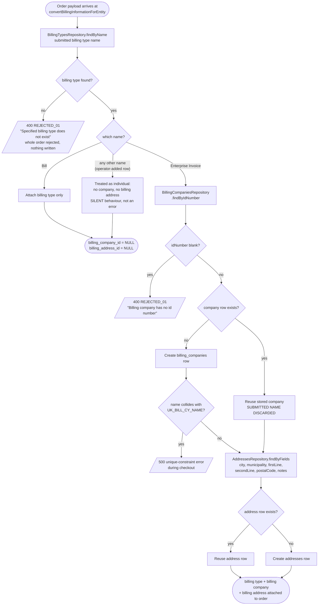
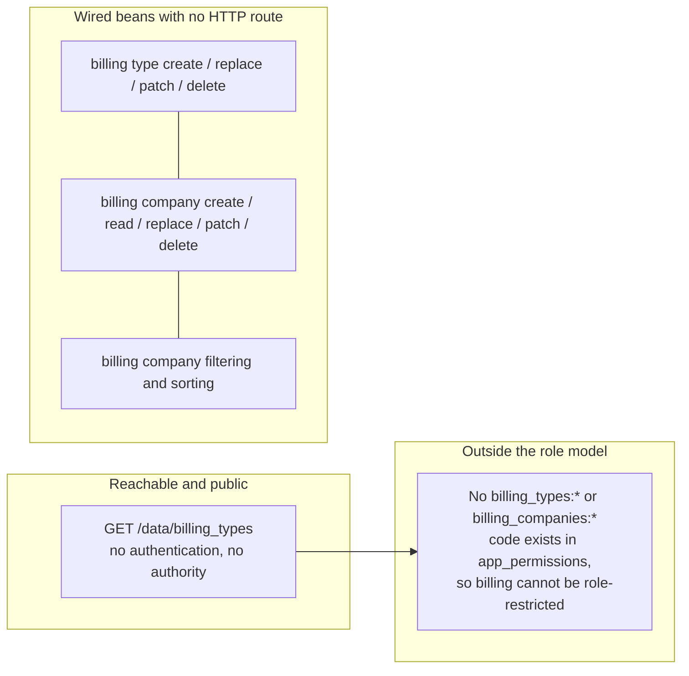
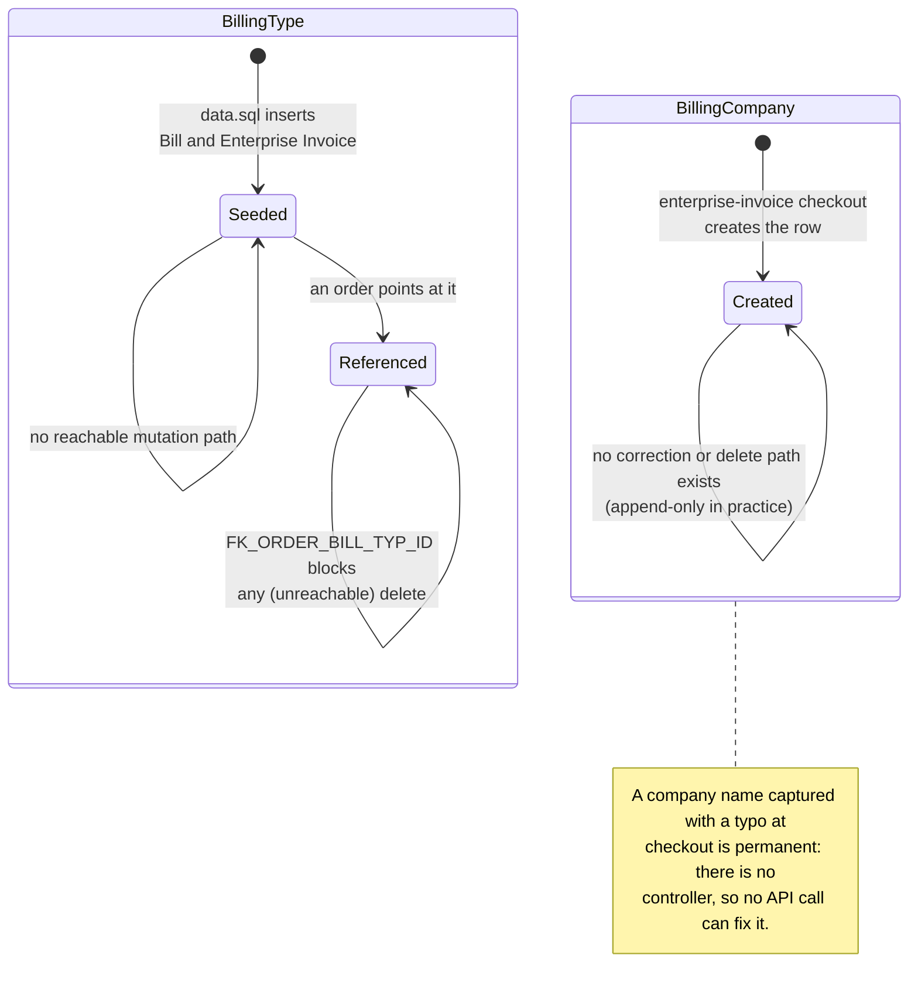

# Workflow diagram — Billing (`billing`)

## Billing-branch decision during order creation

```mermaid
flowchart TD
    Start([Order payload arrives at<br/>convertBillingInformationForEntity]) --> Resolve[BillingTypesRepository.findByName<br/>submitted billing type name]
    Resolve --> Known{billing type found?}
    Known -- no --> Reject[/400 REJECTED_01<br/>"Specified billing type does not exist"<br/>whole order rejected, nothing written/]
    Known -- yes --> Which{which name?}

    Which -- "Bill" --> Individual[Attach billing type only]
    Individual --> IndivDone([billing_company_id = NULL<br/>billing_address_id = NULL])

    Which -- "Enterprise Invoice" --> CoLookup[BillingCompaniesRepository<br/>.findByIdNumber]
    Which -- "any other name<br/>(operator-added row)" --> Fallthrough[Treated as individual:<br/>no company, no billing address<br/>SILENT behaviour, not an error]
    Fallthrough --> IndivDone

    CoLookup --> CoBlank{idNumber blank?}
    CoBlank -- yes --> CoReject[/400 REJECTED_01<br/>"Billing company has no id number"/]
    CoBlank -- no --> CoFound{company row exists?}
    CoFound -- yes --> Reuse[Reuse stored company<br/>SUBMITTED NAME DISCARDED]
    CoFound -- no --> CoCreate[Create billing_companies row]
    CoCreate --> NameClash{name collides with<br/>UK_BILL_CY_NAME?}
    NameClash -- yes --> CoFail[/500 unique-constraint error<br/>during checkout/]
    NameClash -- no --> AddrLookup
    Reuse --> AddrLookup[AddressesRepository.findByFields<br/>city, municipality, firstLine,<br/>secondLine, postalCode, notes]
    AddrLookup --> AddrFound{address row exists?}
    AddrFound -- yes --> AddrReuse[Reuse address row]
    AddrFound -- no --> AddrCreate[Create addresses row]
    AddrReuse --> EntDone
    AddrCreate --> EntDone([billing type + billing company<br/>+ billing address attached to order])
```

## Billing-type and billing-company maintenance reachability

```mermaid
flowchart LR
    subgraph Reachable["Reachable and public"]
        R1["GET /data/billing_types<br/>no authentication, no authority"]
    end
    subgraph Ungoverned["Outside the role model"]
        B1["No billing_types:* or billing_companies:*<br/>code exists in app_permissions,<br/>so billing cannot be role-restricted"]
    end
    subgraph Unreachable["Wired beans with no HTTP route"]
        U1[billing type create / replace / patch / delete]
        U2[billing company create / read / replace / patch / delete]
        U3[billing company filtering and sorting]
    end
    R1 --> B1
    U1 --- U2 --- U3
```

## Lifecycle

```mermaid
stateDiagram-v2
    state "BillingType" as BT {
        [*] --> Seeded: data.sql inserts<br/>Bill and Enterprise Invoice
        Seeded --> Seeded: no reachable mutation path
        Seeded --> Referenced: an order points at it
        Referenced --> Referenced: FK_ORDER_BILL_TYP_ID blocks<br/>any (unreachable) delete
    }
    state "BillingCompany" as BC {
        [*] --> Created: enterprise-invoice checkout<br/>creates the row
        Created --> Created: reused by later orders<br/>with the same idNumber
        Created --> Created: no correction or delete path exists<br/>(append-only in practice)
    }
    note right of BC
        A company name captured with a typo at
        checkout is permanent: there is no
        controller, so no API call can fix it.
    end note
```
