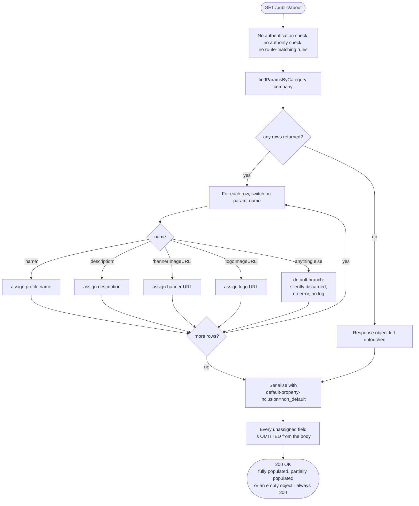
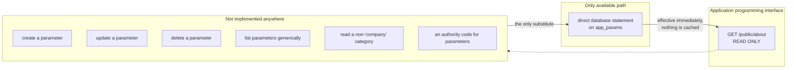
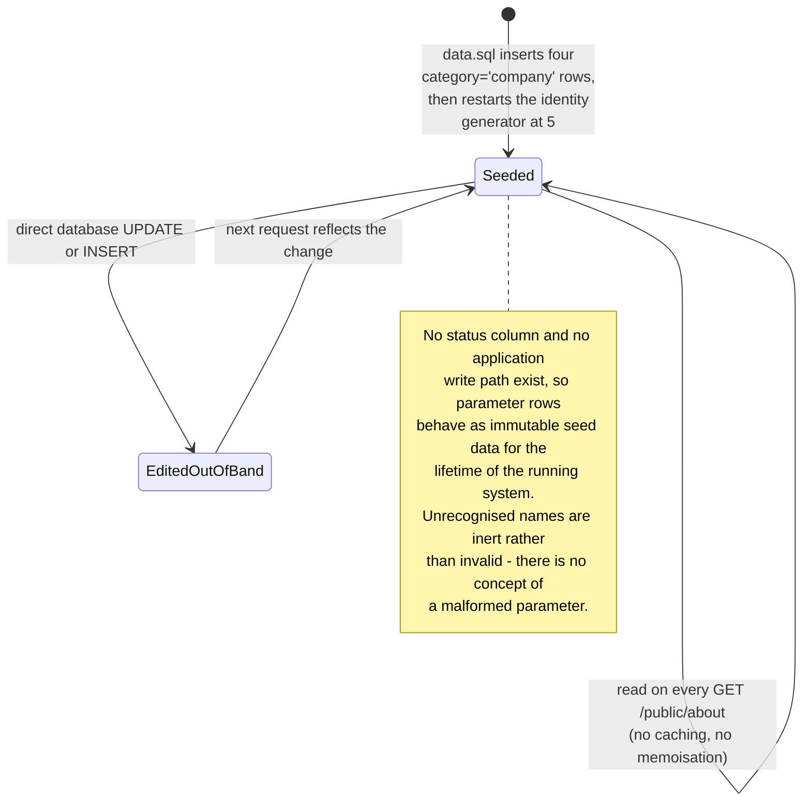

# Workflow diagram — Company Profile (`company-profile`)

## Profile assembly flow

```mermaid
flowchart TD
    Start([GET /public/about]) --> Auth[No authentication check,<br/>no authority check,<br/>no route-matching rules]
    Auth --> Query[findParamsByCategory 'company']
    Query --> Any{any rows returned?}

    Any -- no --> EmptyObj[Response object left untouched]
    Any -- yes --> Loop[For each row, switch on param_name]

    Loop --> N1{name}
    N1 -- "'name'" --> A1[assign profile name]
    N1 -- "'description'" --> A2[assign description]
    N1 -- "'bannerImageURL'" --> A3[assign banner URL]
    N1 -- "'logoImageURL'" --> A4[assign logo URL]
    N1 -- "anything else" --> Ignore[default branch:<br/>silently discarded,<br/>no error, no log]

    A1 --> More
    A2 --> More
    A3 --> More
    A4 --> More
    Ignore --> More{more rows?}
    More -- yes --> Loop
    More -- no --> Serialise

    EmptyObj --> Serialise[Serialise with<br/>default-property-inclusion=non_default]
    Serialise --> Omit[Every unassigned field<br/>is OMITTED from the body]
    Omit --> Done([200 OK<br/>fully populated, partially populated<br/>or an empty object - always 200])
```

## Reachability of profile mutation

```mermaid
flowchart LR
    subgraph API["Application programming interface"]
        R["GET /public/about<br/>READ ONLY"]
    end
    subgraph Missing["Not implemented anywhere"]
        W1["create a parameter"]
        W2["update a parameter"]
        W3["delete a parameter"]
        W4["list parameters generically"]
        W5["read a non-'company' category"]
        W6["an authority code for parameters"]
    end
    subgraph OutOfBand["Only available path"]
        D["direct database statement<br/>on app_params"]
    end

    R -.-> Missing
    Missing -->|"the only substitute"| D
    D -->|"effective immediately,<br/>nothing is cached"| R
```

## Lifecycle

```mermaid
stateDiagram-v2
    [*] --> Seeded: data.sql inserts four<br/>category='company' rows,<br/>then restarts the identity<br/>generator at 5
    Seeded --> Seeded: read on every GET /public/about<br/>(no caching, no memoisation)
    Seeded --> EditedOutOfBand: direct database UPDATE or INSERT
    EditedOutOfBand --> Seeded: next request reflects the change
    note right of Seeded
        No status column and no application
        write path exist, so parameter rows
        behave as immutable seed data for the
        lifetime of the running system.
        Unrecognised names are inert rather
        than invalid - there is no concept of
        a malformed parameter.
    end note
```
