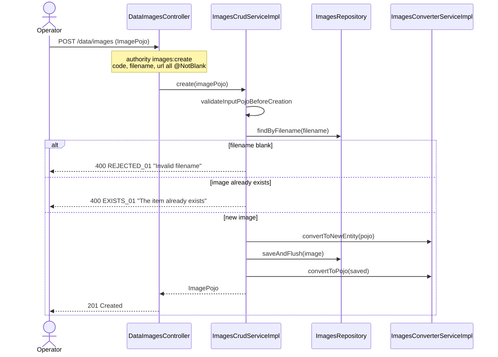
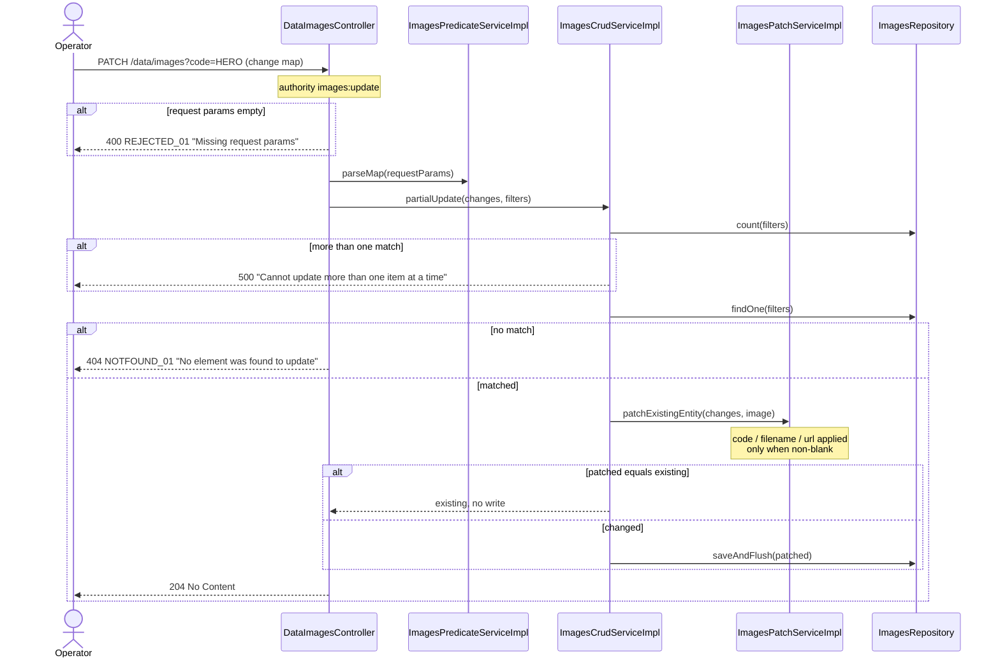
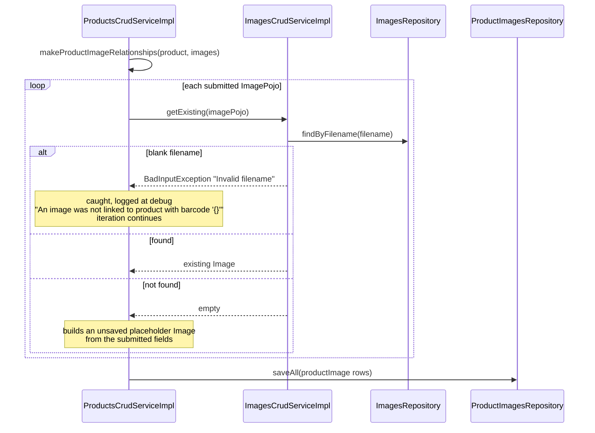

# Sequence diagrams — Image Registry (`image`)

## Register an image (`POST /data/images`)

```mermaid
sequenceDiagram
    actor Operator
    participant DataImagesController
    participant ImagesCrudServiceImpl
    participant ImagesRepository
    participant ImagesConverterServiceImpl

    Operator->>DataImagesController: POST /data/images (ImagePojo)
    Note over DataImagesController: authority images:create<br/>code, filename, url all @NotBlank
    DataImagesController->>ImagesCrudServiceImpl: create(imagePojo)
    ImagesCrudServiceImpl->>ImagesCrudServiceImpl: validateInputPojoBeforeCreation
    ImagesCrudServiceImpl->>ImagesRepository: findByFilename(filename)
    alt filename blank
        ImagesCrudServiceImpl-->>Operator: 400 REJECTED_01 "Invalid filename"
    else image already exists
        ImagesCrudServiceImpl-->>Operator: 400 EXISTS_01 "The item already exists"
    else new image
        ImagesCrudServiceImpl->>ImagesConverterServiceImpl: convertToNewEntity(pojo)
        ImagesCrudServiceImpl->>ImagesRepository: saveAndFlush(image)
        ImagesCrudServiceImpl->>ImagesConverterServiceImpl: convertToPojo(saved)
        ImagesCrudServiceImpl-->>DataImagesController: ImagePojo
        DataImagesController-->>Operator: 201 Created
    end
```

## Patch an image (`PATCH /data/images`)

```mermaid
sequenceDiagram
    actor Operator
    participant DataImagesController
    participant ImagesPredicateServiceImpl
    participant ImagesCrudServiceImpl
    participant ImagesPatchServiceImpl
    participant ImagesRepository

    Operator->>DataImagesController: PATCH /data/images?code=HERO (change map)
    Note over DataImagesController: authority images:update
    alt request params empty
        DataImagesController-->>Operator: 400 REJECTED_01 "Missing request params"
    end
    DataImagesController->>ImagesPredicateServiceImpl: parseMap(requestParams)
    DataImagesController->>ImagesCrudServiceImpl: partialUpdate(changes, filters)
    ImagesCrudServiceImpl->>ImagesRepository: count(filters)
    alt more than one match
        ImagesCrudServiceImpl-->>Operator: 500 "Cannot update more than one item at a time"
    end
    ImagesCrudServiceImpl->>ImagesRepository: findOne(filters)
    alt no match
        DataImagesController-->>Operator: 404 NOTFOUND_01 "No element was found to update"
    else matched
        ImagesCrudServiceImpl->>ImagesPatchServiceImpl: patchExistingEntity(changes, image)
        Note over ImagesPatchServiceImpl: code / filename / url applied<br/>only when non-blank
        alt patched equals existing
            ImagesCrudServiceImpl-->>DataImagesController: existing, no write
        else changed
            ImagesCrudServiceImpl->>ImagesRepository: saveAndFlush(patched)
        end
        DataImagesController-->>Operator: 204 No Content
    end
```

## Image linking during product creation (cross-domain)

```mermaid
sequenceDiagram
    participant ProductsCrudServiceImpl
    participant ImagesCrudServiceImpl
    participant ImagesRepository
    participant ProductImagesRepository

    ProductsCrudServiceImpl->>ProductsCrudServiceImpl: makeProductImageRelationships(product, images)
    loop each submitted ImagePojo
        ProductsCrudServiceImpl->>ImagesCrudServiceImpl: getExisting(imagePojo)
        ImagesCrudServiceImpl->>ImagesRepository: findByFilename(filename)
        alt blank filename
            ImagesCrudServiceImpl-->>ProductsCrudServiceImpl: BadInputException "Invalid filename"
            Note over ProductsCrudServiceImpl: caught, logged at debug<br/>"An image was not linked to product with barcode '{}'"<br/>iteration continues
        else found
            ImagesCrudServiceImpl-->>ProductsCrudServiceImpl: existing Image
        else not found
            ImagesCrudServiceImpl-->>ProductsCrudServiceImpl: empty
            Note over ProductsCrudServiceImpl: builds an unsaved placeholder Image<br/>from the submitted fields
        end
    end
    ProductsCrudServiceImpl->>ProductImagesRepository: saveAll(productImage rows)
```
