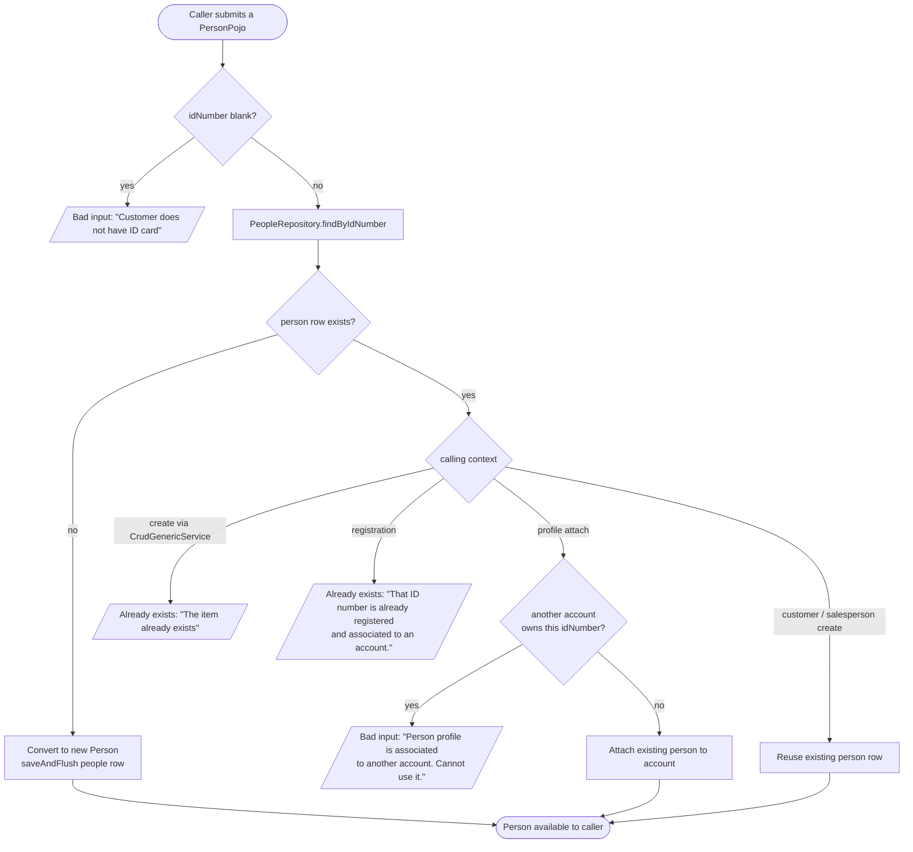
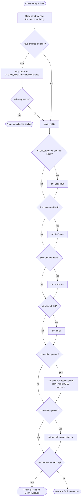
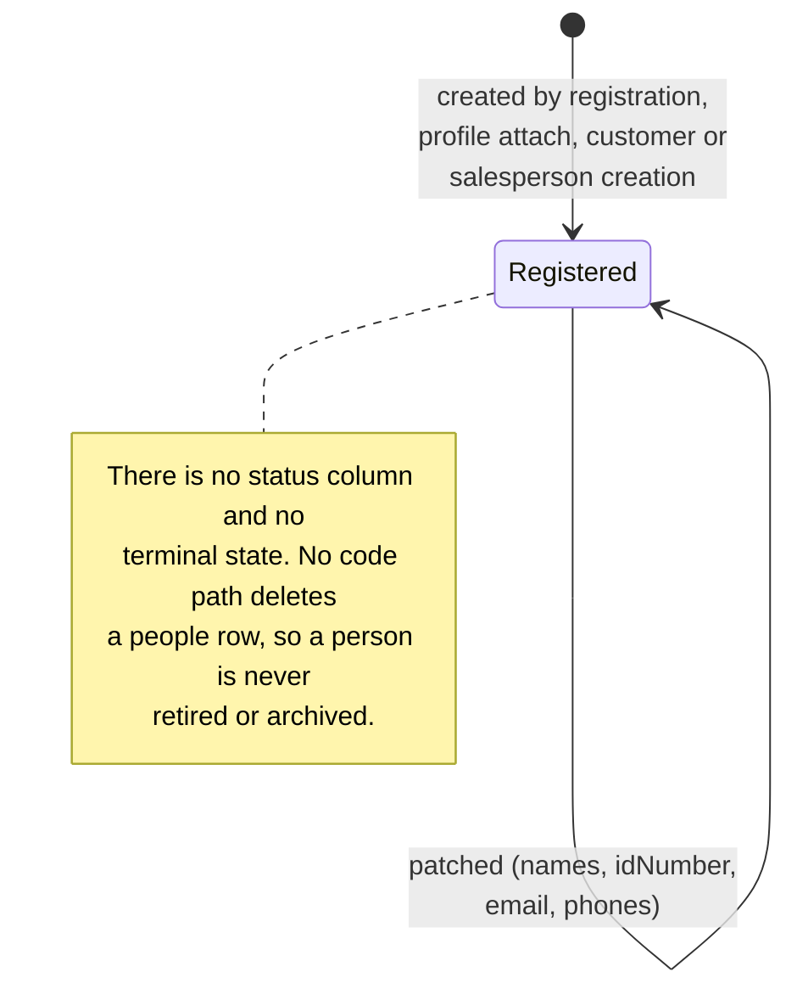

# Workflow diagram — Person Registry (`person`)

## Person resolution decision flow (shared by every writing caller)

```mermaid
flowchart TD
    Start([Caller submits a PersonPojo]) --> Blank{idNumber blank?}
    Blank -- yes --> RejectBlank[/Bad input: "Customer does not have ID card"/]
    Blank -- no --> Lookup[PeopleRepository.findByIdNumber]
    Lookup --> Found{person row exists?}

    Found -- no --> Create[Convert to new Person<br/>saveAndFlush people row]
    Create --> Linked([Person available to caller])

    Found -- yes --> Context{calling context}
    Context -- "create via CrudGenericService" --> Conflict[/Already exists: "The item already exists"/]
    Context -- "registration" --> RegConflict[/Already exists: "That ID number is already registered<br/>and associated to an account."/]
    Context -- "profile attach" --> Owned{another account<br/>owns this idNumber?}
    Owned -- yes --> OwnedReject[/Bad input: "Person profile is associated<br/>to another account. Cannot use it."/]
    Owned -- no --> Attach[Attach existing person to account]
    Attach --> Linked
    Context -- "customer / salesperson create" --> Reuse[Reuse existing person row]
    Reuse --> Linked
```

## Person patch field-by-field flow

```mermaid
flowchart TD
    P([Change map arrives]) --> Copy[Copy-construct new Person from existing]
    Copy --> Prefixed{keys prefixed 'person.'?}
    Prefixed -- yes --> Strip[Strip prefix via Utils.copyMapWithUnprefixedEntries]
    Strip --> Empty{sub-map empty?}
    Empty -- yes --> Skip([No person change applied])
    Empty -- no --> Fields
    Prefixed -- no --> Fields

    Fields[Apply fields] --> N1{idNumber present and non-blank?}
    N1 -- yes --> S1[set idNumber]
    N1 -- no --> N2
    S1 --> N2{firstName non-blank?}
    N2 -- yes --> S2[set firstName]
    N2 -- no --> N3
    S2 --> N3{lastName non-blank?}
    N3 -- yes --> S3[set lastName]
    N3 -- no --> N4
    S3 --> N4{email non-blank?}
    N4 -- yes --> S4[set email]
    N4 -- no --> N5
    S4 --> N5{phone1 key present?}
    N5 -- yes --> S5[set phone1 unconditionally<br/>blank value DOES overwrite]
    N5 -- no --> N6
    S5 --> N6{phone2 key present?}
    N6 -- yes --> S6[set phone2 unconditionally]
    N6 -- no --> Compare
    S6 --> Compare{patched equals existing?}
    Compare -- yes --> NoWrite([Return existing, no UPDATE issued])
    Compare -- no --> Write([saveAndFlush people row])
```

## Lifecycle

```mermaid
stateDiagram-v2
    [*] --> Registered: created by registration,<br/>profile attach, customer or<br/>salesperson creation
    Registered --> Registered: patched (names, idNumber,<br/>email, phones)
    note right of Registered
        There is no status column and no
        terminal state. No code path deletes
        a people row, so a person is never
        retired or archived.
    end note
```
