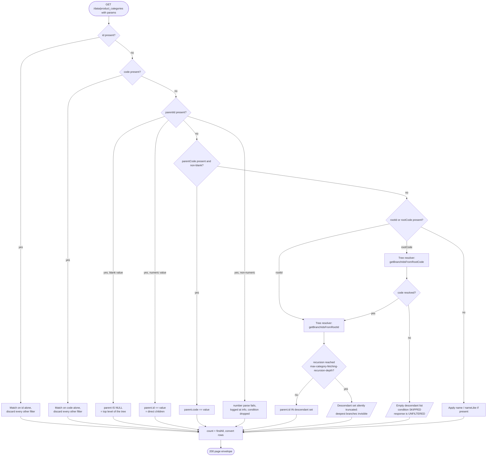
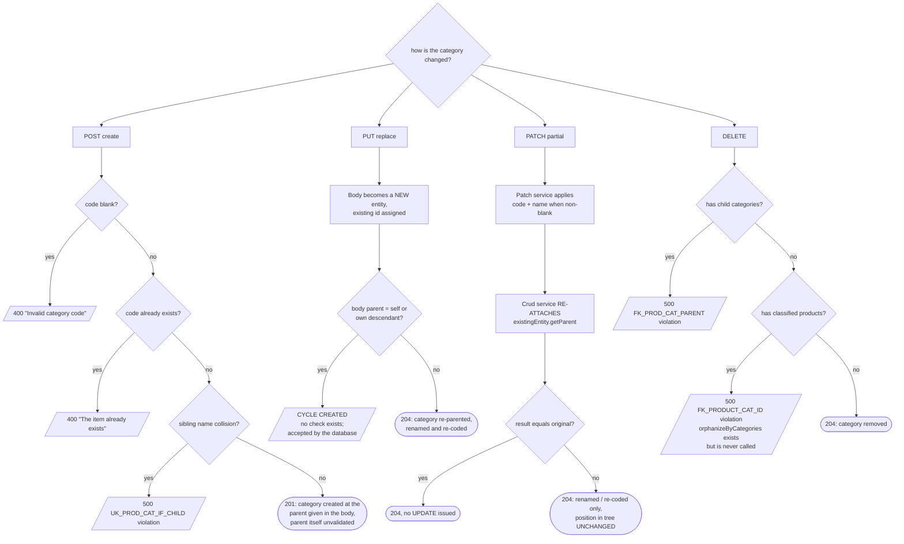
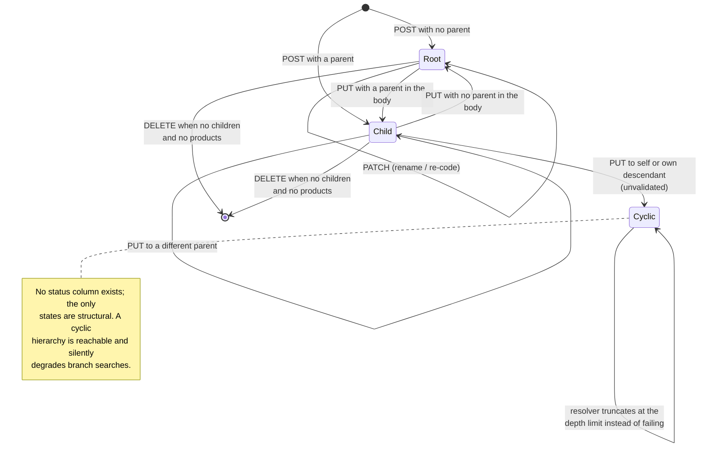

# Workflow diagram — Product Category Tree (`product-category`)

## Category filter resolution

```mermaid
flowchart TD
    Start([GET /data/product_categories with params]) --> Id{id present?}
    Id -- yes --> ShortId[Match on id alone,<br/>discard every other filter]
    Id -- no --> Code{code present?}
    Code -- yes --> ShortCode[Match on code alone,<br/>discard every other filter]
    Code -- no --> Parent{parentId present?}

    Parent -- "yes, blank value" --> Roots[parent IS NULL<br/>= top level of the tree]
    Parent -- "yes, numeric value" --> Children[parent.id == value<br/>= direct children]
    Parent -- "yes, non-numeric" --> Swallow[number parse fails,<br/>logged at info, condition dropped]
    Parent -- no --> ParentCode{parentCode present and non-blank?}

    ParentCode -- yes --> ChildrenByCode[parent.code == value]
    ParentCode -- no --> Root{rootId or rootCode present?}

    Root -- rootId --> ExpandId[Tree resolver:<br/>getBranchIdsFromRootId]
    Root -- rootCode --> ResolveCode[Tree resolver:<br/>getBranchIdsFromRootCode]
    ResolveCode --> CodeFound{code resolved?}
    CodeFound -- no --> Unfiltered[/Empty descendant list<br/>condition SKIPPED<br/>response is UNFILTERED/]
    CodeFound -- yes --> ExpandId
    ExpandId --> Depth{recursion reached<br/>max-category-fetching-<br/>recursion-depth?}
    Depth -- yes --> Truncated[/Descendant set silently truncated:<br/>deepest branches invisible/]
    Depth -- no --> InSet[parent.id IN descendant set]

    Root -- no --> NameKeys[Apply name / nameLike if present]

    ShortId --> Fetch
    ShortCode --> Fetch
    Roots --> Fetch
    Children --> Fetch
    ChildrenByCode --> Fetch
    Swallow --> Fetch
    InSet --> Fetch
    Truncated --> Fetch
    Unfiltered --> Fetch
    NameKeys --> Fetch[count + findAll, convert rows]
    Fetch --> Out([200 page envelope])
```

## Structural-change paths and what each can do

```mermaid
flowchart TD
    Which{how is the category changed?} --> Post[POST create]
    Which --> Put[PUT replace]
    Which --> Patch[PATCH partial]
    Which --> Del[DELETE]

    Post --> P1{code blank?}
    P1 -- yes --> PR1[/400 "Invalid category code"/]
    P1 -- no --> P2{code already exists?}
    P2 -- yes --> PR2[/400 "The item already exists"/]
    P2 -- no --> P3{sibling name collision?}
    P3 -- yes --> PR3[/500 UK_PROD_CAT_IF_CHILD violation/]
    P3 -- no --> PDone([201: category created at the<br/>parent given in the body,<br/>parent itself unvalidated])

    Put --> U1[Body becomes a NEW entity,<br/>existing id assigned]
    U1 --> U2{body parent = self or<br/>own descendant?}
    U2 -- yes --> UCycle[/CYCLE CREATED<br/>no check exists;<br/>accepted by the database/]
    U2 -- no --> UDone([204: category re-parented,<br/>renamed and re-coded])

    Patch --> C1[Patch service applies<br/>code + name when non-blank]
    C1 --> C2[Crud service RE-ATTACHES<br/>existingEntity.getParent]
    C2 --> C3{result equals original?}
    C3 -- yes --> CNo([204, no UPDATE issued])
    C3 -- no --> CDone([204: renamed / re-coded only,<br/>position in tree UNCHANGED])

    Del --> D1{has child categories?}
    D1 -- yes --> DR1[/500 FK_PROD_CAT_PARENT violation/]
    D1 -- no --> D2{has classified products?}
    D2 -- yes --> DR2[/500 FK_PRODUCT_CAT_ID violation<br/>orphanizeByCategories exists<br/>but is never called/]
    D2 -- no --> DDone([204: category removed])
```

## Lifecycle

```mermaid
stateDiagram-v2
    [*] --> Root: POST with no parent
    [*] --> Child: POST with a parent
    Root --> Root: PATCH (rename / re-code)
    Child --> Child: PATCH (rename / re-code,<br/>parent always preserved)
    Root --> Child: PUT with a parent in the body
    Child --> Root: PUT with no parent in the body
    Child --> Child: PUT to a different parent
    Child --> Cyclic: PUT to self or own descendant<br/>(unvalidated)
    Cyclic --> Cyclic: resolver truncates at the<br/>depth limit instead of failing
    Root --> [*]: DELETE when no children<br/>and no products
    Child --> [*]: DELETE when no children<br/>and no products
    note right of Cyclic
        No status column exists; the only
        states are structural. A cyclic
        hierarchy is reachable and silently
        degrades branch searches.
    end note
```
